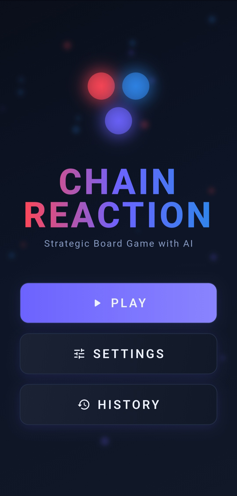
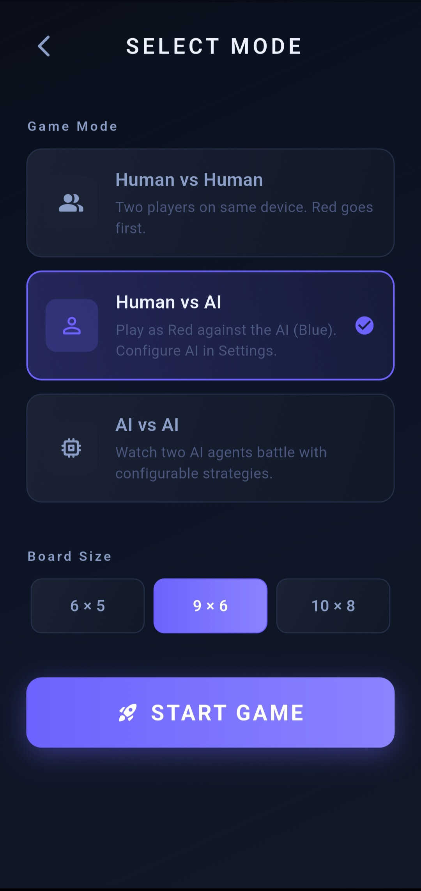
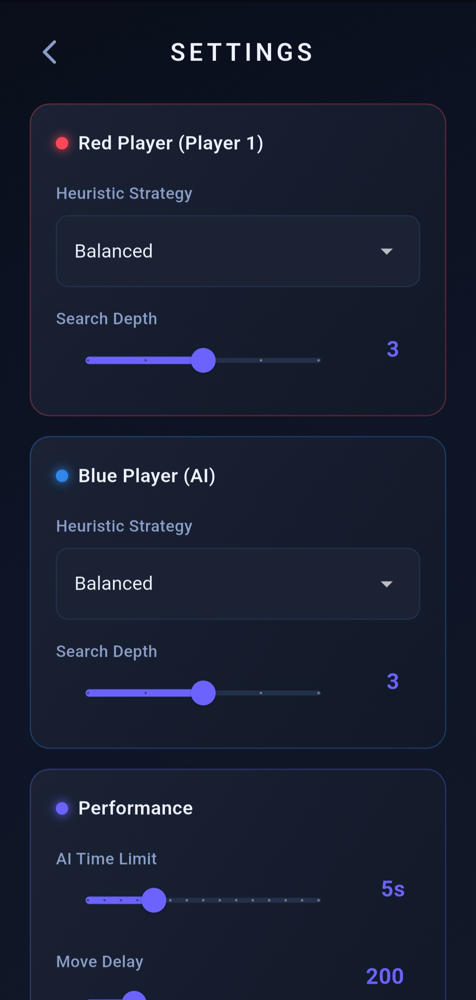
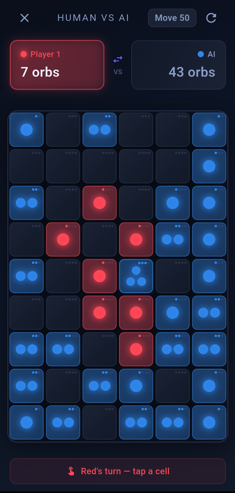
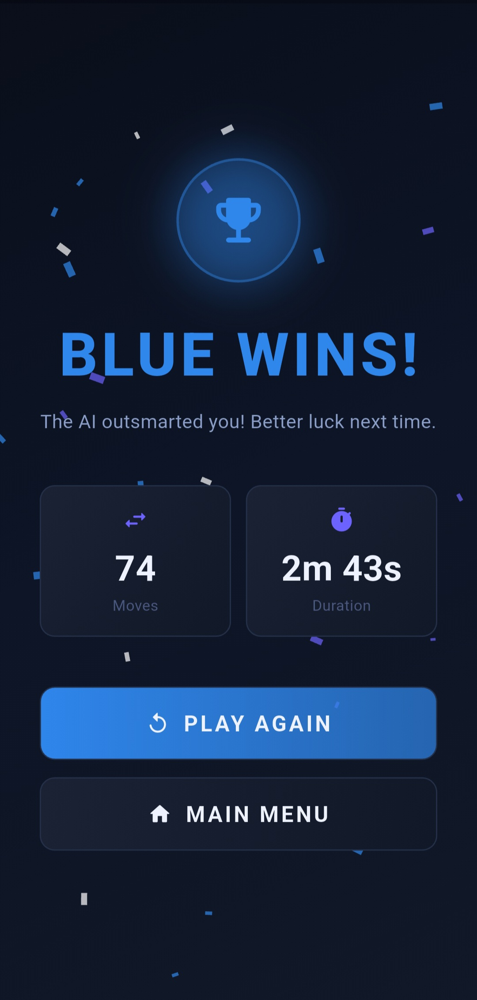

# 🧬 Chain Reaction: Cyber Search Edition

[](https://flutter.dev)
[](https://dart.dev)
[](LICENSE)

A complete, modern rebuild of the classic **Chain Reaction** strategy game. Written from scratch using **Flutter & Dart**, this edition focuses on a premium cyberpunk dark theme, smooth physics-like animations, and a highly competitive AI engine that runs completely on background threads.

---

## 📲 Quick Start: Grab the Installer

Get the latest optimized game build directly on your Android device:

> ⚡ **[📥 Download the Release App (app-release.apk) 📥](https://github.com/YOUR_GITHUB_USERNAME/YOUR_REPO_NAME/releases/download/v1.0.0/app-release.apk)**  
> *(Note: Replace this link with your published release link after uploading to GitHub)*

### Simple Installation Steps:
1. Tap the download link on your phone.
2. Open your file manager, head to **Downloads**, and click on `app-release.apk`.
3. If Android warns you about installing apps from unknown sources, just click **Allow** or **Install Anyway** to bypass the warning.

---

## 🎮 Game Modes & Features

*   **Local Match (Pass & Play)**: Challenge your friends locally on a single device. Take turns placing orbs and planning chain reactions.
*   **Solo Battle (Vs. AI)**: Put your skills to the test against our custom AI engine. You play as **Red**, the AI plays as **Blue**.
*   **AI Sandbox (AI vs. AI)**: Set two computer players against each other. Customize their depths and heuristic weights to see which algorithmic strategy wins.
*   **Custom Board Sizes**: Choose between a quick **6×5** board, the standard **9×6** grid, or a larger **10×8** arena.
*   **Game History & Stats**: Revisit your past matches, check your win/loss records, and analyze your move metrics.

---

## 🧠 Inside the AI: How it Thinks

The AI is built to play like a human player—looking ahead, defending territory, and setting traps. 

### Search Algorithm
To find the absolute best move, the AI utilizes a **Minimax search tree** optimized with **Alpha-Beta Pruning**. It plays out virtual turns in its head up to 5 moves deep. 
*   **Pruning** allows the AI to immediately discard bad moves, saving processing power to search deeper.
*   **Iterative Deepening** ensures the AI thinks dynamically: it searches shallow paths first and goes deeper until its time limit is reached, guaranteeing it never freezes or hangs.

### The 5 Heuristics
The AI evaluates how "good" a board looks using a combination of five strategies:

1.  **Orb Dominance** (Orb Count): Simple math. The AI calculates who has more total orbs.
2.  **Volcano Threat** (Critical Mass): The AI looks for cells that are right on the edge of exploding, placing a high value on keeping these ready.
3.  **High Ground** (Strategic Position): Corners (critical mass 2) and edges (critical mass 3) are much easier to defend. The AI prioritizes capturing these early on.
4.  **Chokehold** (Opponent Mobility): The AI evaluates how many legal moves you have left and tries to block or restrict your options.
5.  **The Trap Card** (Explosion Potential): The AI looks for situations where placing an orb next to your cells can trigger a massive chain reaction, instantly converting your colors.

---

## ⚡ Developer Notes & Optimizations

We built this app with performance in mind. Here is how we kept the animations running at 60 FPS even while the AI is analyzing millions of configurations:

*   **Zero-Lag Calculations (Dart Isolates)**: Minimax searches can freeze the interface. To prevent this, all search logic runs on a background worker thread (Isolate), keeping the gameplay animations buttery smooth.
*   **Queue-Based BFS Engine**: Recursive functions can crash apps due to stack overflows during massive chain reactions. We rewrote the explosion logic to use an iterative Breadth-First Search (BFS) queue.
*   **Immutable State Management**: Our game state uses lightweight, immutable Dart data structures. Copying the board for AI simulation is incredibly cheap and memory-efficient.

---

## 📸 Screenshots

<div align="center">
  <table border="0">
    <tr>
      <td><p align="center"><b>Home Menu</b></p></td>
      <td><p align="center"><b>Game Setup</b></p></td>
      <td><p align="center"><b>AI Options</b></p></td>
    </tr>
    <tr>
      <td><p align="center"><b>Gameplay</b></p></td>
      <td><p align="center"><b>Match Summary</b></p></td>
      <td><p align="center"><b>Match Logs</b></p></td>
    </tr>
  </table>
</div>

---

## 🛠️ Building the Project Locally

If you want to run the code locally or build it from source:

1.  **Clone the code:**
    ```bash
    git clone https://github.com/YOUR_GITHUB_USERNAME/YOUR_REPO_NAME.git
    cd YOUR_REPO_NAME
    ```
2.  **Install the dependencies:**
    ```bash
    flutter pub get
    ```
3.  **Run the game:**
    *   For Web/Chrome: `flutter run -d chrome`
    *   For Windows Desktop: `flutter run -d windows`
    *   For Android: Connect your phone and run `flutter run`

---

## 📄 License

This project is licensed under the MIT License.
